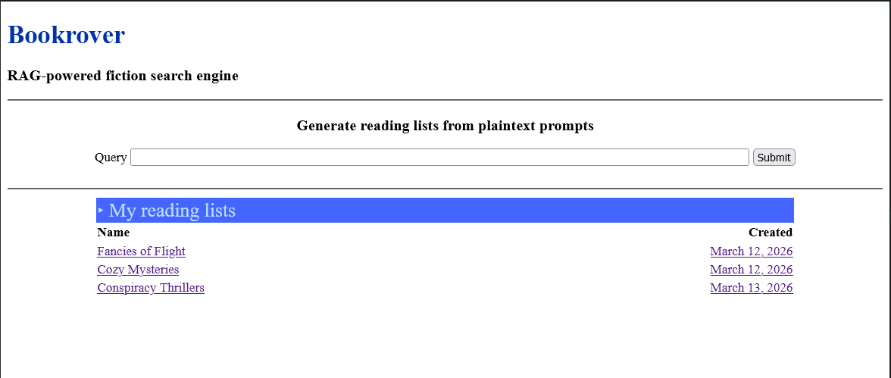
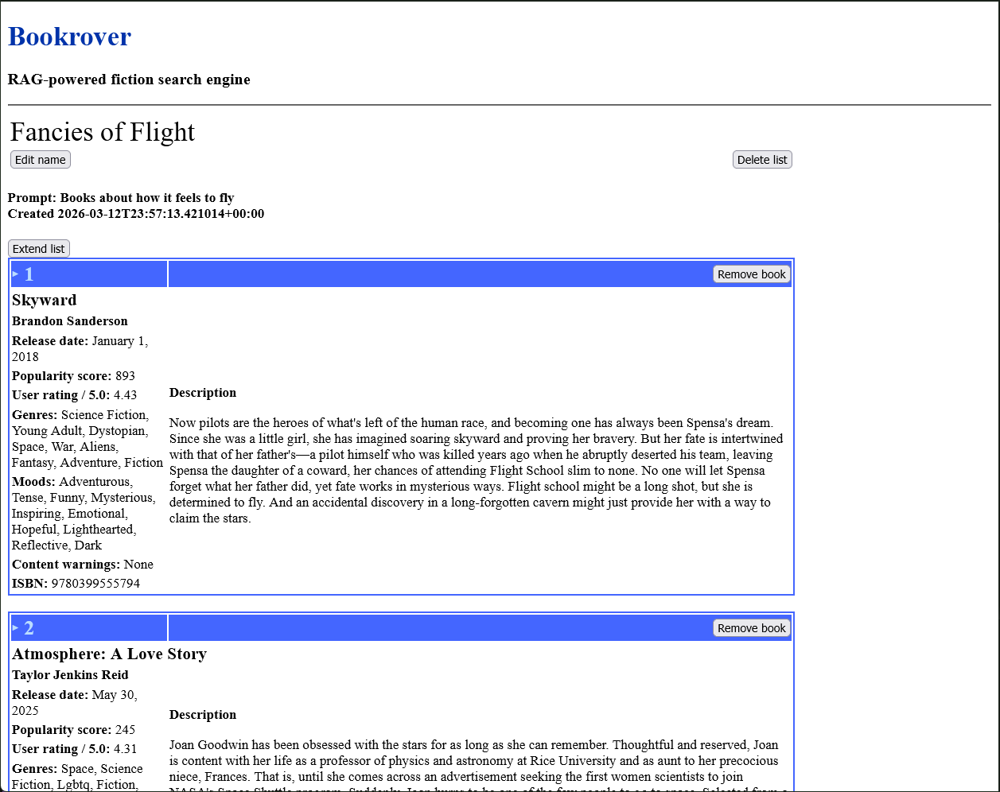

# Bookrover

RAG-powered fiction search engine.
GitHub: https://github.com/sikyanakotik/bookrover  
Docker Hub: https://hub.docker.com/r/sikyanakotik/bookrover



## Purpose
Bookrover is an RAG recommendation engine for novels, allowing users to create reading lists based on natural language query prompts, based on its database of book metadata scraped from [Hardcover](https://hardcover.app).

It can be difficult to find new books that match what you want to read. Web searches, even LLM-assisted ones, rely on keywords that often can't capture the greater tones or themes of a book. Getting around this relies heavily on expert-curated lists that are outdated almost as soon as they're published, and can't fully grasp the greater landscape of fiction. Bookrover keeps a database of book data, updated regularly, and uses RAG search and semantic embedding to recommend books based on themes, mood, similarity to other works, and other qualities that are hard to capture with keywords and lists alone. It also allows users to curate their saved lists, rejecting inappropriate responses and extending lists with new recommendations. 

Authors can also use this system find comparable titles for marketing their manuscripts to agents or publishers, or to keep an eye on the latest trends in a genre.

## Docker Installation

### Prerequisites
We recommend installing and running Bookrover via its Docker image. To do this, you will need Docker + Docker Compose already installed. You will also need:

- An API key for Hardcover (obtainable from [https://hardcover.app/account/api](https://hardcover.app/account/api) with a free Hardcover account).
- An API key for an LLM service. Bookrover currently supports Anthropic, Google, and OpenAI models. We strongly recommend using a lightwight model, such as Anthropic's Claude Haiku series.
- Optionally, an API key for [HuggingFace](https://huggingface.co).

### Installation steps

- Download ```.env.example``` to an empty ```bookrover``` folder. Rename the file to ```.env```

- Open the ```.env``` file and edit the following information:
    - *HARDCOVER_API_KEY:* Put your Hardcover API here.
    - *HUGGING_FACE_TOKEN:* Optionally, put your HuggingFace API key here. If you don't want to include one, leave it blank.
    - *LLM_TYPE:* Put the name of your LLM provider here. Currently, Bookrover supports "Anthropic", "Google", and "OpenAI", with "Claude", "Gemini", and "ChatGPT" as respective aliases. This is case sentitive.
    - *LLM_MODEL:* Put the name of the model you wish to use here, as you would provide it when using the LLM's provider's own API service. Again, we strongly recommend using a lightwight model, such as Anthropic's Claude Haiku series.
    - *LLM_API_KEY:* Put the API key for your LLM provider here.

- The other environment variables can be left as defaults or altered as you wish. If hosting Bookrover on a public server, we strongly recommend changing *POSTGRES_USERNAME* and *POSTGRES_PASSWORD*, as these define the username and password used by Bookrover's scraper and API engine services.

- Pull the Docker image from DockerHub. In a Linux shell, use:
```
docker pull sikyanakotik/bookrover
```

- In your ```bookrover``` folder, run the image mounting the env file and the ```bookrover_postgres``` docker volume. In a Linux shell, use:
```
docker run -v bookrover_postgres:/var/lib/postgresql/data -v $(pwd)/.env:/app/.env -p 8080:8080 -p 21801:21801 sikyanakotik/bookrover
```

- Open http://localhost:8080 in your browser. You should now see Bookrover's front page.

- When done, you can stop the container with Ctrl-C or through Docker Desktop.

The book database is initially empty, so you will likely want to leave the container running overnight to allow the scraper to obtain a sufficient corpus to run queries on. Depending on your internet speed and API rate limits, a few hours should be enough to fetch a few thousand books.

## Direct Installation
If you don't want to use Docker, you can run the code directly. In addition to the previous requirements, you will also need:
- PostgreSQL version 16 with pgvector
- Python 3.13 or better
- Node 21.7 or better
- uv and npm

### Installation steps
- After cloning the repo, use ```uv sync``` to install the Python dependencies and ```npm install``` to install the Node.js dependencies. 
- Rename and set up the ```.env``` variable as in the Docker installations instructions, making sure the *POSTGRES_HOST* and *POSTGRES_PORT* variables match your PostgreSQL server.

- In the PostgreSQL server, create a user with username and password matching the *POSTGRES_USERNAME* and *POSTGRES_PASSWORD* variables in the ```.env```, and give that user full permissions. Also create a database named "bookrover".

- Initialize the database by running the scraper service with the ```reset``` parameter. In a Linux shell, use:
```
npm run scraper reset
```

- To run the program, start the three services individually in different shell windows:
```
npm run scraper background
npm run engine server
npm run webserver
```

## Services
Bookrover consists of four services:
- ```bookrover```, a PostgreSQL database which stores all persistent program data, including book metadata and reading lists. Responds to SQL requests from ```scraper``` and ```engine```.
- ```scraper```, which ingests, processes, and stores book metadata from Hardcover, populating the database and keeping it up to date. Sends SQL requests to ```bookrover```.
- ```engine```, the API engine that runs query searches, manages reading lists, and responds to requests from the webserver. Sends SQL requests to ```bookrover``` and responds to HTTP requests from ```webserver```.
- ```webserver```, which runs the user interface to the program over a dedicated website. Sends HTTP requests to ```engine```.

All services except ```scraper``` must be running simultaneously for the program to function.

## Use
The website is the primary interface to Bookrover. While you can interact with directly with the ```engine``` API using ```curl```, this is not recommended and will not be detailed here.

Bookrover's website uses two primary views: the *front page* and the *reading list page*.

### Front page


From the front page, you can generate new reading lists and view your existing lists. To create a new list, type your prompt in the query bar, then click the "Submit" button or press Enter. After the list is created, you will immediately be taken to its page. New lists are created with the ten most relevant books to the query, and are named "New List" by default. A list may have fewer than ten books if there are fewer than ten valid candidates.

Prompts are written in natural language, and processed with a hybrid search using LLM-based keyword extraction and embedding-based semantic search. A book's popularity and recency is also a factor in its rankings.

Queries work best when they describe the genre, mood, and content of books to search for, in either the positive or negative sense. The engine cannot yet put hard ranges on properties such as publication date or average rating, nor can it effectively search for books similar to an existing book.

When there are reading lists in the database, they will also be listed on this page with their name and creation date.

You can return to the front page at any time by clicking on "Bookrover" in the title bar.

### Reading list page

This page lists the contents of a reading list, along with the list's name, prompt, and time of creation. Each book includes the title, author, blurb description, and other relevant metadata. While this listing does not currently include direct links to Hardcover, the title, author, and description should be sufficient to find the book on Hardcover, Goodreads, or a retailer.

You can rename the reading list with the "Edit name" button. Clicking this button makes the title field editable, and clicking it again or pressing Enter saves the change to the database. Reading list names do not have to be unique.

The "Delete list" button removes the reading list from the database after a confirmation. Deleted lists cannot be recovered.

The "Extend list" buttons at the top and bottom of the page runs another search, adding five more books to the reading list. It may add fewer than five books if there are fewer than five valid candidates.

Each book listing has a "Remove book" button. Clicking this button removes the book from the reading list after a confirmation. Removed books are excluded when extending this reading list, but not from other reading lists.

## API
The engine service exposes a JSON API used by the webserver. It includes endpoints for:

- creating reading lists from prompts,
- fetching lists by ID,
- extending lists,
- and removing books.

For most users, using the website is recommended. Advanced users can inspect the OpenAPI/Flask routes in ```engine``` for integration details.

## Future development
Paths for future development are likely to include:
- Expanded LLM integration to identify requests to set ranges on publication date, average rating, and similar fields.
- Expanded LLM integration to identify requests to find books like an existing book in the database, then apply a sematic search using that book's embedding vector.
- Give the user the ability to mark books as read, adding them to an archive page.
- Give the user the ability to mark books as liked or disliked, generating a user preference vector to steer future searches.
- Give the server or scraper the ability to add Hardcover, Goodreads, and store links to books in reading lists.
- Add professional formatting for the website using CSS and hand-drawn assets, including a logo.
- Support for multiple users on an online hosted service.

Further development will be undertaken based on the interest of both the community and the lead developer.

## License
This project is [MIT](https://choosealicense.com/licenses/mit/) licensed.

## Contributing
Please contribute by forking the repo and opening pull requests. All pull requests should be submitted to the `main` branch. Feel free to submit an issue if you find a bug, or to request a feature you think should be included.

## About the Developer
Bookrover was developed by Patrick Dale Reding as a portfolio project. Patrick is a mathematician, writer, and solver of interesting problems living in Kanata, Ontario, Canada.